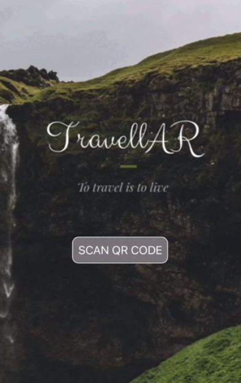

# TravellAR

This repository contains the entire source code, built using ViroReact and React Native, for TravellAR AR App. TravellAR provides a AR experience to the user by providing a 360 degree and immersive experience of a tourist spot.

       

## Installation

Follow the installation guide below to set up and run this source code locally on Mac/Linux (For setting up on Windows, go through Windows specific steps to setup Android Studio [here](https://docs.viromedia.com/docs/quick-start-windows) and [here](https://docs.viromedia.com/docs/installing-viro-android)

### Prerequisites

1. Make sure you have installed Viro media app
2. And have gone through [Quick Start (Mac/Linux)](https://docs.viromedia.com/docs/quick-start) page and installed the required dependencies.
3. iOS Device with A9 chip or higher and running iOS 11 or an [ARCore supported device](https://developers.google.com/ar/discover/supported-devices) running Android N or higher.
4. For iOS - Xcode 9 or later.
5. For Android - Android Studio for the Android SDK and tools.

   _Make sure to install the Android SDK and build tools for API level 26_

### Clone Repo

```
git clone https://github.com/rahul-narayanan/TravellAR
cd TravellAR
```

### Install and setup dependencies

#### All platforms

```
npm install
```

#### iOS

```
cd ios
pod install
```

#### Android

Nothing needed here

### Running and Debugging the app

```
npm start
```

#### Android

1. For Android, make sure you have downloaded and installed Android Studio from [here](https://developer.android.com/studio/install) to get required SDK and platform-tools for building android apps
   Make sure you have the required environment variables set - `$ANDROID_HOME`, and added `platform-tools` to `$PATH` variable. If not,
   ```
   export ANDROID_HOME=/YOUR_PATH_TO/Android/sdk
   export PATH=$ANDROID_HOME/platform-tools:$PATH
   export PATH=$ANDROID_HOME/tools:$PATH
   ```
2. To build, install and launch the android app, from the root of the project (`TravellAR/` directory)
   ```
   react-native run-android --variant=assembleDebug
   ```

## Project Structure

The JS portion of the app is structured as below:

```
TravellAR/
├── android
|   ├── contains files that are needed to build the apk from the js resources
├── ios
|   ├── contains files that are needed to build the apk from the js resources
├── js
|   ├── app.js    // Home page of the app
|   ├── HomePage.js  // Page that opens camera for scanning qr code
|   ├── Listspot.js  // Page that displays available spots that can be viewed by the user
|   ├── locations.js // Data store of the app that contains information about each locations
|   └── res - contains static resources used in the app
├── index.js // Entry point of the app which registers the application
├── index.android.js // Entry point of the app for android
├── index.ios.js // Entry point of the app for ios
├── app-init.js // Renders login, register and home page by the use of react state
├── package.json // contains dependencies, dev dependencies and scripts that are needed to develop and build this application
```
